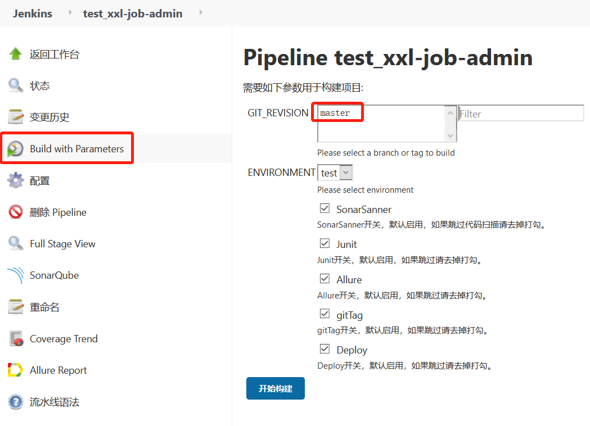
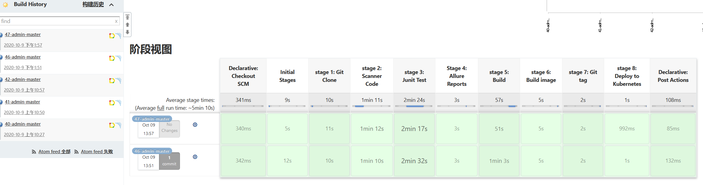
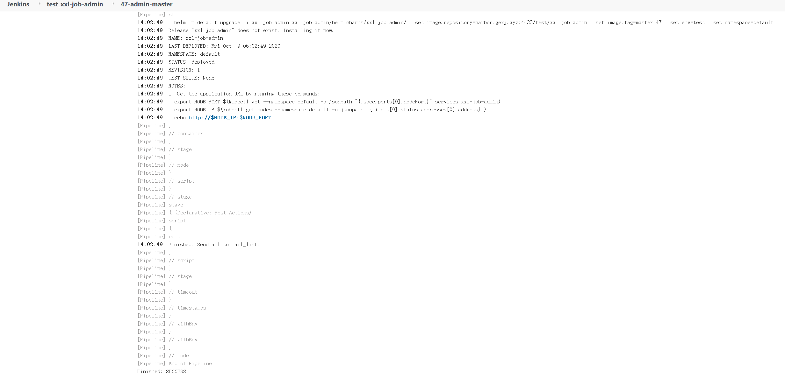
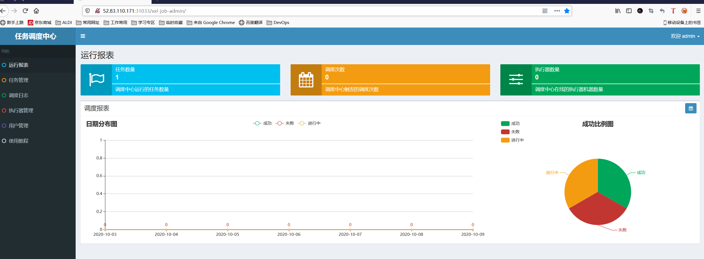

## 应用概述 

XXL-JOB 一个开源的任务调度中心

* 项目地址： http://github.com/gxjluck/xxl-job-admin.git

* jenkins地址： http://68.79.41.99:30002/job/test_xxl-job-admin/   用户名/密码： admin/admin
* 最终应用部署结果： http://52.83.110.171:31033/xxl-job-admin/    用户名/密码： admin/123456

## 流水线阶段描述

* git clone： 代码克隆
* sonarqube scanner： 代码扫描
* Junit Test： 单元测试
* Allure ： 测试结果图表生成
* Maven Build： 代码编译
* Docker Build:   把编译的jar包打成docker images
* git tag：  管理本次git版本，给本次编译成功的代码打tag标记
* Deployment： 把docker image通过helm部署到kubernetes集群
* Post： 发送结果邮件

## 工具链描述

* jenkins： CICD工具，部署在k8s集群，采用动态slave
* gitlab： 代码管理
* sonarqube： 代码质量扫描
* allure： 测试结果报表生成工具
* maven： java代码编译打包
* harbor： docker镜像仓库管理
* nexus： 制成品管理
* helm： 应用部署管理工具
* MySQL： xxl-job-admin 连接数据库
* postgresql: sonarqube连接数据库

## CI/CD 功能

* 代码质量扫描
* 单元测试
* 测试报表生成
* 代码编译打包
* docker images制作
* git tag管理
* 应用部署
* 发送邮件

## 演示说明

* 参数化构建

  

* Pipleline 阶段视图

  

* Pipeline 执行日志部分截图

  

* 应用部署结果截图

  
